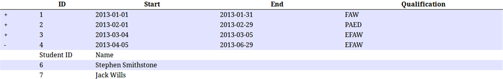

# Qualsafe technical test

### Notes ###

Written in React

1) Install docker
2) Install npm/node
3) npm run build
4) npm run docker_run

Optionally:

5) npm start - for development build

Qualsafes website was broken due to configuration. You need prod running to get the development environment working.

### Technical Test ###

This task aims to test your client side web skills. You need to create a web page that lists unpaid courses and the
students enrolled on each.

The list of unpaid courses is available via a web service, in JSONP format, at:
http://www.qualsafe.com/getCourses.php?action=getUnpaid

The course list should include the following data:
• Course ID • Start Date • End Date • Qualification Type

Each course in the list should be expandable/collapsible to show/hide the students enrolled on the course. Student
details to be shown are:
• Student ID • Name

Here is an example of what the page might look like:
